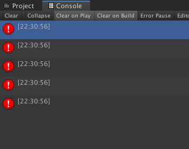
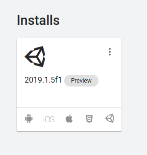

#Ubuntu 19, Unity 2019.1.5f1

## Breaking Bugs
1. Unidentifiable errors in console
  - No descriptions
  - Preventing playing game

## Just annoyances

1. Adding existing project bug
  - First install of unity hub you cannot add a project, you have to create a new one, then after that you canm add an existing project.

2. Stuck in full screen
  - After installation, opening an existing project and the unity editor is full screen with no title bar, cannot move the window at all.
  - Fixed after logging out or rebooting

3. Scrolling inside editor bug
  - [Video of the problem](https://youtu.be/7wh_EIzj2vk)
  - Temporary Fix: Pulling window down and maximizing it again each time Unity is opened.

4. Can't create Mac builds
  - Mac module installed by does not show up in Build Settings > PC, Mac & Linux Standalone, Cannot create mac builds.

